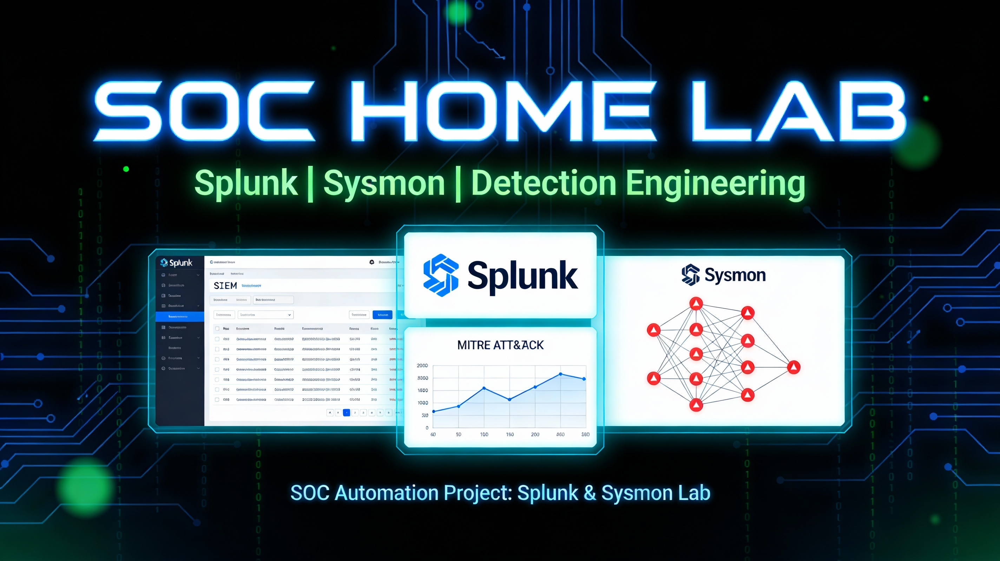
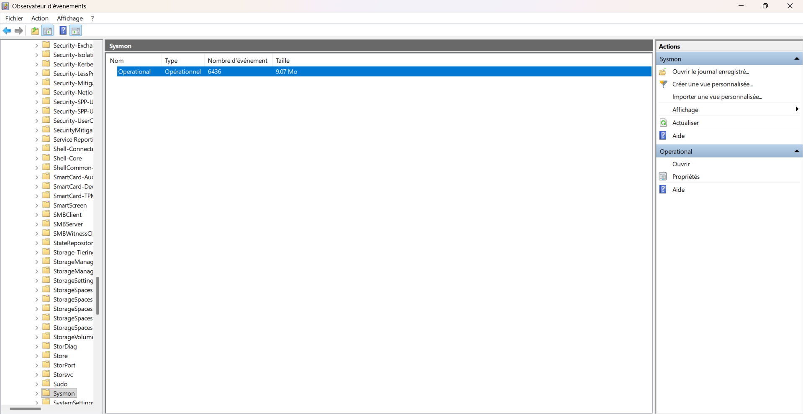

# SOC-Lab-Portfolio



> **Résumé :** Un laboratoire de détection complet simulant les techniques MITRE ATT&CK (T1547) et concevant des règles de détection à l'aide de Splunk Enterprise et Sysmon.

## Architecture
| Composant | Technologie | Rôle |
|-----------|------------|------|
| **SIEM** | Splunk Enterprise | Agrégation et analyse des journaux |
| **Endpoint** | Windows 11 | Machine de la Victime |
| **Télémétrie** | Sysmon (SwiftOnSecurity) | Journalisation avancée |
| **Transport** | Universal Forwarder | Expédition des journaux |

> [!WARNING]
> Dans cette architecture, la machine physique joue le rôle de la machine de la victime. **Cela ne doit jamais être le choix privilégié dans une situation normale.** Dans mon cas pour des soucis de compatibilité, j'ai toutefois été contraint d'utiliser la machine physique comme machine victime.

---
**Schéma de flux :**
[Windows 11 + Sysmon + UF] ---(Port 9997)---> [Windows Server 2022 + Splunk Enterprise]

---
## Installation et Configuration

### Étape 1 : Déploiement de Sysmon (Endpoint)
Sysmon a été installé sur la machine Windows 11 avec la configuration communautaire de référence (SwiftOnSecurity) pour maximiser la visibilité sur les activités critiques.

```powershell
# Téléchargement de Sysmon et de la config
Invoke-WebRequest -Uri https://download.sysinternals.com/files/Sysmon.zip -OutFile Sysmon.zip
Expand-Archive Sysmon.zip -DestinationPath C:\Sysmon

# Installation avec configuration SwiftOnSecurity
cd C:\Sysmon
.\Sysmon64.exe -i sysmonconfig-export.xml -accepteula
```

Processus de validation :


> *Installation réussie de Sysmon v15.15. Le service est actif et les logs sont visibles dans l'Observateur d'événements Windows sous `Microsoft-Windows-Sysmon/Operational`.*

> [!NOTE]
> Sysmon a bien été installé et est fonctionnel !
