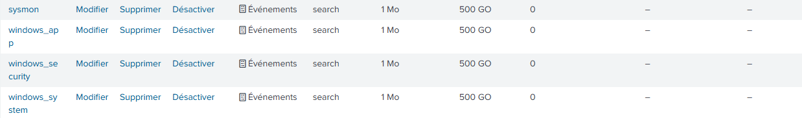

# SOC-Lab


> **Résumé :** Un laboratoire de détection complet simulant les techniques MITRE ATT&CK (T1547) et concevant des règles de détection à l'aide de Splunk Enterprise et Sysmon.

## Architecture
| Composant | Technologie | Rôle |
|-----------|------------|------|
| **SIEM** | Splunk Enterprise | Agrégation et analyse des journaux |
| **Endpoint** | Windows 11 | Machine de la Victime |
| **Télémétrie** | Sysmon (SwiftOnSecurity) | Journalisation avancée |
| **Transport** | Universal Forwarder | Expédition des journaux |

> [!WARNING]
> Dans cette architecture, la machine physique joue le rôle de la machine de la victime. **Cela ne doit jamais être le choix privilégié dans une situation normale.** Dans mon cas, pour des soucis de compatibilité, j'ai toutefois été contraint d'utiliser la machine physique comme machine victime.

---
**Schéma de flux :**
[Windows 11 + Sysmon + UF] ---(Port 9997)---> [Windows Server 2022 + Splunk Enterprise]

### 📚 Prérequis : Installation de l'Infrastructure
Avant de configurer la collecte, Splunk Enterprise et l'Universal Forwarder doivent être installés. Voici les tutoriels que j'ai personnellement utilisés:

1. 📺 **[Installation de Splunk Enterprise sur Windows](https://www.youtube.com/watch?v=kESCizBHhtM)** (Serveur)
2. 📺 **[Installation de l'Universal Forwarder sur Windows](https://www.youtube.com/watch?v=wd4BLsJThQY)** (Victime)

> *Note : Les interfaces peuvent varier légèrement selon les versions, mais le principe reste identique.*

**⚠️ Modifications OBLIGATOIRES pour ce Lab :**

Lors de l'installation de l'Universal Forwarder sur la machine victime :

1. **Receiving Indexer (Indexeur de réception) :**
   - **IP :** Entrez l'adresse IP de votre serveur Splunk, celle avec votre Splunk Universal Forwarder, compatible avec toutes les machines modernes. 
   - **Port :** `9997` (Port par défaut).

2. **Compte de service :**
   - Sélectionnez **Local System** pour garantir que l'agent ait les droits suffisants pour lire les journaux de Sécurité et Système.

3. **Logs par défaut :**
   - **Décochez tout** dans l'installateur (Application, Security, System).
   - *Nous allons configurer cela manuellement et plus proprement via le fichier `inputs.conf` à l'Étape 2.*

---
## Installation et Configuration

### Étape 1 : Déploiement de Sysmon (Endpoint)
Sysmon a été installé sur la machine Windows 11 avec la configuration communautaire de référence (SwiftOnSecurity) pour maximiser la visibilité sur les activités critiques.

> [!IMPORTANT]
> N'oubliez pas de télécharger le fichier [sysmonconfig-export.xml](https://github.com/SwiftOnSecurity/sysmon-config/blob/master/sysmonconfig-export.xml).


```powershell
# Téléchargement de Sysmon et de la config sysmonconfig-export.xml
Invoke-WebRequest -Uri https://download.sysinternals.com/files/Sysmon.zip -OutFile Sysmon.zip
Expand-Archive Sysmon.zip -DestinationPath C:\Sysmon

# Installation avec configuration SwiftOnSecurity
cd C:\Sysmon
# Veuillez remplacer <chemin_config> par le chemin réel du fichier téléchargé
.\Sysmon64.exe -i <chemin_config>\sysmonconfig-export.xml -accepteula
```

**Processus de validation**:


> *Installation réussie de Sysmon. Le service est actif et les logs sont visibles dans l'Observateur d'événements Windows sous `Microsoft-Windows-Sysmon/Operational`.*

**Sysmon a bien été installé et est fonctionnel !**

### Étape 2 : Configuration de l'Universal Forwarder

L'Universal Forwarder (UF) a été configuré pour capturer les logs Sysmon et les transmettre au serveur Splunk via TCP/9997.

**Fichier :** `C:\Program Files\SplunkUniversalForwarder\etc\system\local\inputs.conf` par défaut. Voici un template dont vous pourrez vous servir:
**[Télécharger le template complet ici](config/Template_inputs.conf)**
 
### Étape 3 : Configuration des Index sur Splunk Enterprise
>[!NOTE]
> Avant de recevoir les logs, les index définis dans la configuration de l'UF doivent être créés sur le serveur Splunk.**Sans cela, Splunk rejettera les données entrantes.**
> Créons donc ces fameux index.

**Index à créer :**
- `sysmon`
- `windows_security`
- `windows_system`
- `windows_app`



>[!NOTE]
> A ce stade, index=main source="*Sysmon*" devrait vous retourner un résultat non vide sur Splunk après quelques minutes.


Sur le serveur Windows Server 2022, Splunk doit être configuré pour accepter les connexions entrantes des Forwarders.

Vous pouvez configurer de votre côté la réception via l'interface web de Splunk Enterprise :
Paramètres > Transfert et réception > Configurer la réception

Ajout du port 9997 pour correspondre aux instructions ci-dessus.


Règle Pare-feu Windows Server :

```powershell
New-NetFirewallRule -DisplayName "Splunk Receiver" -Direction Inbound -Protocol TCP -LocalPort 9997 -Action Allow
```
