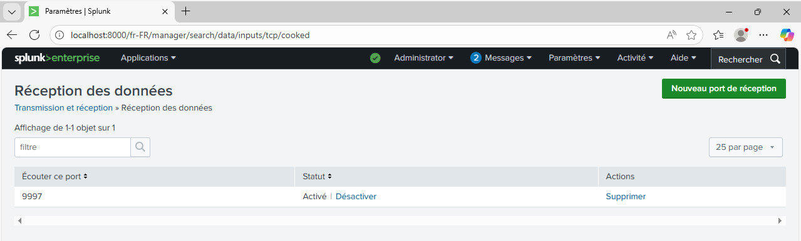

# SOC-Lab-Portfolio


> **Résumé :** Un laboratoire de détection complet simulant les techniques MITRE ATT&CK (T1547) et concevant des règles de détection à l'aide de Splunk Enterprise et Sysmon.

## Architecture
| Composant | Technologie | Rôle |
|-----------|------------|------|
| **SIEM** | Splunk Enterprise | Agrégation et analyse des journaux |
| **Endpoint** | Windows 11 | Machine de la Victime |
| **Télémétrie** | Sysmon (SwiftOnSecurity) | Journalisation avancée |
| **Transport** | Universal Forwarder | Expédition des journaux |

> [!WARNING]
> Dans cette architecture, la machine physique joue le rôle de la machine de la victime. **Cela ne doit jamais être le choix privilégié dans une situation normale.** Dans mon cas, pour des soucis de compatibilité, j'ai toutefois été contraint d'utiliser la machine physique comme machine victime.

---
**Schéma de flux :**
[Windows 11 + Sysmon + UF] ---(Port 9997)---> [Windows Server 2022 + Splunk Enterprise]

---
## Installation et Configuration

### Étape 1 : Déploiement de Sysmon (Endpoint)
Sysmon a été installé sur la machine Windows 11 avec la configuration communautaire de référence (SwiftOnSecurity) pour maximiser la visibilité sur les activités critiques.

> [!IMPORTANT]
> N'oubliez pas de télécharger le fichier [sysmonconfig-export.xml](https://github.com/SwiftOnSecurity/sysmon-config/blob/master/sysmonconfig-export.xml).


```powershell
# Téléchargement de Sysmon et de la config sysmonconfig-export.xml
Invoke-WebRequest -Uri https://download.sysinternals.com/files/Sysmon.zip -OutFile Sysmon.zip
Expand-Archive Sysmon.zip -DestinationPath C:\Sysmon

# Installation avec configuration SwiftOnSecurity
cd C:\Sysmon
# Veuillez remplacer <chemin_config> par le chemin réel du fichier téléchargé
.\Sysmon64.exe -i <chemin_config>\sysmonconfig-export.xml -accepteula
```

**Processus de validation**:


> *Installation réussie de Sysmon. Le service est actif et les logs sont visibles dans l'Observateur d'événements Windows sous `Microsoft-Windows-Sysmon/Operational`.*

**Sysmon a bien été installé et est fonctionnel !**

### Étape 2 : Configuration de l'Universal Forwarder

L'Universal Forwarder (UF) a été configuré pour capturer les logs Sysmon et les transmettre au serveur Splunk via TCP/9997.

**Fichier :** `C:\Program Files\SplunkUniversalForwarder\etc\system\local\inputs.conf` par défaut. Je vous ai préparé un template:

```ini
# ============================================
# FICHIER : inputs.conf
# ============================================
# Description : Configuration de l'Universal Forwarder pour la collecte
#               des journaux Windows et Sysmon vers le serveur Splunk.
# Contexte    : Lab Blue Team / Formation SOC Analyst
# Serveur     : <IP_SERVEUR_SPLUNK>:9997 (voir outputs.conf)
# Date        : <DATE_CONFIGURATION>
# Auteur      : <VOTRE_NOM>
# ============================================
#
# INSTRUCTIONS :
#
# 1. Remplacez les valeurs suivantes selon votre environnement :
#    - <NOM_MACHINE>        : Nom de votre machine Windows (ex: WIN10-LAB-01)
#    - <INDEX_SYSMON>       : Nom de l'index Splunk pour Sysmon (ex: sysmon)
#    - <INDEX_SECURITY>     : Nom de l'index pour Security (ex: windows_security)
#    - <INDEX_SYSTEM>       : Nom de l'index pour System (ex: windows_system)
#    - <INDEX_APPLICATION>  : Nom de l'index pour Application (ex: windows_app)
#
# 2. Ajustez les whitelists/blacklists selon vos besoins :
#    - Sysmon : Event IDs critiques pour votre cas d'usage
#    - Security : Événements d'authentification et de gestion des comptes
#    - System/Application : Filtrez les Event IDs générant trop de bruit
#
# 3. Vérifiez que les index existent côté Splunk Indexer/Search Head
#    (Configuration > Indexes)
#
# 4. Après modification, redémarrez le Forwarder :
#    net stop SplunkForwarder && net start SplunkForwarder
#
# 5. Validez la configuration avec :
#    "%PROGRAMFILES%\SplunkUniversalForwarder\bin\splunk.exe" btool inputs list --debug
#
# AVERTISSEMENT :
# Cette configuration est optimisée pour un environnement de test/lab.
# Pour une utilisation en production, consultez votre équipe sécurité.
#
# ============================================

[default]
# Remplacez par le nom de votre machine
host = <NOM_MACHINE>


# ============================================
# SURVEILLANCE CRITIQUE : Logs Sysmon
# ============================================
# Le journal Sysmon fournit une visibilité détaillée sur :
# - la création de processus, les connexions réseau, les modifications de registre
# - les événements d'injection de code et de persistence

[WinEventLog://Microsoft-Windows-Sysmon/Operational]
# Active la collecte (0 = activé, 1 = désactivé)
disabled = 0

# Index dédié pour séparer les logs Sysmon des autres sources Windows
index = <INDEX_SYSMON>

# Sourcetype explicite pour faciliter le parsing et les extractions de champs
sourcetype = XmlWinEventLog:Microsoft-Windows-Sysmon/Operational

# Format XML brut pour préserver la structure hiérarchique complète
renderXml = 1

# Fréquence de sauvegarde de la position de lecture (en secondes)
# Valeur basse = reprise plus précise après redémarrage mais plus d'I/O disque
checkpointInterval = 5

# Whitelist des Event IDs critiques pour limiter le volume de données
# Event ID 1  : Process Creation          | Event ID 3  : Network Connection
# Event ID 7  : Image Loaded (DLL)        | Event ID 8  : CreateRemoteThread
# Event ID 10 : Process Access (Mimikatz) | Event ID 11 : File Creation
# Event ID 13 : Registry Value Set        | Event ID 17 : Pipe Created
# Event ID 18 : Pipe Connected            | Event ID 19 : WMI Event Filter
# Event ID 20 : WMI Event Consumer        | Event ID 21 : WMI Filter-Consumer Binding
# Event ID 22 : DNS Query
# AJUSTEZ SELON VOS BESOINS (retirer la whitelist = tout collecter, ce qui augmentera drastiquement le volume)
whitelist = 1,3,7,8,10,11,13,17,18,19,20,21,22


# ============================================
# SURVEILLANCE SÉCURITÉ : Events Windows
# ============================================
# Le journal Security contient les événements d'authentification,
# de gestion des comptes, et de modification des groupes.

[WinEventLog://Security]
disabled = 0

index = <INDEX_SECURITY>

sourcetype = WinEventLog:Security
renderXml = 1

# Whitelist des Event IDs critiques pour la détection d'intrusions
# 4624 : Logon réussi              | 4625 : Logon échoué
# 4648 : Logon explicite (RunAs)   | 4672 : Logon avec privilèges admin
# 4688 : Création de processus     | 4697 : Installation de service
# 4698 : Tâche planifiée créée     | 4720 : Compte utilisateur créé
# 4722 : Compte utilisateur activé | 4732/4733 : Modification groupe local
# 4756 : Modification groupe global
# AJUSTEZ SELON VOS BESOINS
whitelist = 4624,4625,4648,4672,4688,4697,4698,4720,4722,4732,4733,4756


# ============================================
# SURVEILLANCE SYSTÈME : Events Windows
# ============================================
# Le journal System contient les événements du noyau, des drivers,
# des services Windows, et du client DNS.

[WinEventLog://System]
disabled = 0

index = <INDEX_SYSTEM>

sourcetype = WinEventLog:System
renderXml = 1

# Blacklist des Event IDs générant du bruit (à ajuster selon l'environnement)
# 1014 : Événements DNS client (très fréquents)
# 1030 : Événements Group Policy peu pertinents en lab
# ⚙️ AJUSTEZ SELON VOS BESOINS (commenter la ligne = tout collecter)
blacklist = 1014,1030


# ============================================
# SURVEILLANCE APPLICATION : Events Windows
# ============================================
# Le journal Application contient les événements des applications tierces
# (antivirus, applications métier, etc.).

[WinEventLog://Application]
disabled = 0

index = <INDEX_APPLICATION>

sourcetype = WinEventLog:Application
renderXml = 1


# ============================================
# FIN DU FICHIER inputs.conf
# ============================================
# Pour valider la configuration :
#   1. Vérifier la syntaxe :
#      "%PROGRAMFILES%\SplunkUniversalForwarder\bin\splunk.exe" btool inputs list --debug
#
#   2. Redémarrer le service :
#      net stop SplunkForwarder && net start SplunkForwarder
#
#   3. Vérifier la réception des logs dans Splunk :
#      index=<INDEX_SYSMON> earliest=-15m | stats count by host, sourcetype
# ============================================
```
### Étape 3 : Configuration de Splunk Enterprise
Sur le serveur Windows Server 2022, Splunk a été configuré pour accepter les connexions entrantes des Forwarders.

Vous pouvez configurer la réception via l'interface web de Splunk Enterprise :
Settings > Forwarding and receiving > Configure receiving

Ajout du port 9997 pour correspondre aux instructions ci-dessus.




**Validation de la réception des logs** : index=main source="*Sysmon*" devrait vous retourner un résultat non vide sur Splunk


Règle Pare-feu Windows Server :

```powershell
New-NetFirewallRule -DisplayName "Splunk Receiver" -Direction Inbound -Protocol TCP -LocalPort 9997 -Action Allow
```
