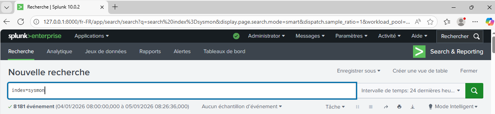

# SOC-Lab


> **Résumé :** Un laboratoire de détection complet simulant les techniques MITRE ATT&CK (T1547) et concevant des règles de détection à l'aide de Splunk Enterprise et Sysmon.

## Architecture
| Composant | Technologie | Rôle |
|-----------|------------|------|
| **SIEM** | Splunk Enterprise | Agrégation et analyse des journaux |
| **Endpoint** | Windows 11 | Machine de la Victime |
| **Télémétrie** | Sysmon (SwiftOnSecurity) | Journalisation avancée |
| **Transport** | Universal Forwarder | Expédition des journaux |

> [!WARNING]
> Dans cette architecture, la machine physique joue le rôle de la machine de la victime. **Cela ne doit jamais être le choix privilégié dans une situation normale.** Dans mon cas, pour des soucis de compatibilité, j'ai toutefois été contraint d'utiliser la machine physique comme machine victime.

---
**Schéma de flux :**
[Windows 11 + Sysmon + UF] ---(Port 9997)---> [Windows Server 2022 + Splunk Enterprise]

### 📚 Prérequis : Installation de l'Infrastructure
Avant de configurer la collecte, Splunk Enterprise et l'Universal Forwarder doivent être installés. Voici les tutoriels que j'ai personnellement utilisés:

1.  **[Installation de Splunk Enterprise sur Windows](https://www.youtube.com/watch?v=kESCizBHhtM)** (Serveur)
2.  **[Installation de l'Universal Forwarder sur Windows](https://www.youtube.com/watch?v=wd4BLsJThQY)** (Victime)

> *Note : Les interfaces peuvent varier légèrement selon les versions, mais le principe reste identique.*

**⚠️ Modifications OBLIGATOIRES pour ce Lab :**

Lors de l'installation de l'Universal Forwarder sur la machine victime :

1. **Receiving Indexer (Indexeur de réception) :**
   - **IP :** Entrez l'adresse IP de votre Serveur Splunk Enterprise (Destination).
   - **Port :** `9997` (Port par défaut).

2. **Compte de service :**
   - Sélectionnez **Local System** pour garantir que l'agent ait les droits suffisants pour lire les journaux de Sécurité et Système.

3. **Logs par défaut :**
   - **Décochez tout** dans l'installateur (Application, Security, System).
   - *Nous allons configurer cela manuellement et plus proprement via le fichier `inputs.conf` à l'Étape 2.*

---
## Installation et Configuration

### Étape 1 : Déploiement de Sysmon (Endpoint)
Sysmon a été installé sur la machine Windows 11 avec la configuration communautaire de référence (SwiftOnSecurity) pour maximiser la visibilité sur les activités critiques.

> [!IMPORTANT]
> N'oubliez pas de télécharger le fichier [sysmonconfig-export.xml](https://github.com/SwiftOnSecurity/sysmon-config/blob/master/sysmonconfig-export.xml).


```powershell
# Téléchargement de Sysmon et de la config sysmonconfig-export.xml
Invoke-WebRequest -Uri https://download.sysinternals.com/files/Sysmon.zip -OutFile Sysmon.zip
Expand-Archive Sysmon.zip -DestinationPath C:\Sysmon

# Installation avec configuration SwiftOnSecurity
cd C:\Sysmon
# Veuillez remplacer <chemin_config> par le chemin réel du fichier téléchargé
.\Sysmon64.exe -i <chemin_config>\sysmonconfig-export.xml -accepteula
```

**Processus de validation**:


> *Installation réussie de Sysmon. Le service est actif et les logs sont visibles dans l'Observateur d'événements Windows sous `Microsoft-Windows-Sysmon/Operational`.*

**Sysmon a bien été installé et est fonctionnel !**

### Étape 2 : Configuration de l'Universal Forwarder

L'Universal Forwarder (UF) a été configuré pour capturer les logs Sysmon et les transmettre au serveur Splunk via TCP/9997.

**Fichier :**  `C:\Program Files\SplunkUniversalForwarder\etc\system\local\inputs.conf` (À créer s'il n'existe pas). Voici un template dont vous pourrez vous servir:
**[Télécharger le template complet ici](config/Template_inputs.conf)**
 
### Étape 3 : Configuration des Index sur Splunk Enterprise

Sur le serveur Windows Server 2022, Splunk doit être configuré pour accepter les connexions entrantes des Forwarders.

Vous pouvez configurer de votre côté la réception via l'interface web de Splunk Enterprise :
Paramètres > Transfert et réception > Configurer la réception

Ajout du port 9997 pour correspondre aux instructions ci-dessus:


Maintenant que l'ouverture logicielle est effectuée, on peut passer à l'ouverture du réseau toujours sur le serveur Windows Server 2022: 

```powershell
New-NetFirewallRule -DisplayName "Splunk Receiver" -Direction Inbound -Protocol TCP -LocalPort 9997 -Action Allow
```


Une fois la règle pare-feu activée sur le serveur, validez immédiatement que le flux est ouvert depuis la machine **Victime** :
```powershell
 Test-NetConnection -ComputerName ADRESSEDEVOTRESERVEUR -Port 9997
```

**Résultat attendu :** `TcpTestSucceeded : True`.
*Si ce test échoue, inutile d'aller plus loin : vérifiez l'IP et le Pare-feu.*

>[!NOTE]
> Avant de recevoir les logs, les index définis dans la configuration de l'UF doivent être créés sur le serveur Splunk.**Sans cela, Splunk rejettera les données entrantes.**

Pour créer des indexes, il vous faut aller sur Splunk Enterprise puis aller dans Paramètres > Données > Index > Nouveau index. Vous pouvez tout laisser par défaut.

**Index à créer :**
- `sysmon`
- `windows_security`
- `windows_system`
- `windows_app`
  
**Attention, ces indexes sont les mêmes que ceux indiqués dans votre fichier de configuration inputs.conf**
  


>[!NOTE]
> A ce stade, "index=sysmon" devrait vous retourner un résultat non vide sur Splunk Entreprise après quelques minutes. Si ce n'est pas le cas, vérifiez les logs de splunkd dans le répertoire par défaut est **"C:\Program Files\SplunkUniversalForwarder\var\log\splunk\splunkd.log"** sur la machine avec l'Universal Forwarder pour débugguer. Dans mon cas, le **code d'erreur associé était le 5**, indiquant un manque de permission. La commande **C:\Windows\System32>wevtutil sl Microsoft-Windows-Sysmon/Operational /ca:O:BAG:SYD:(A;;0xf0007;;;SY)(A;;0x7;;;BA)(A;;0x7;;;SO)(A;;0x7;;;IU)(A;;0x7;;;SU)(A;;0x7;;;S-1-5-3-1024-1065365936-1281604716-3511738428-1654721687-9514)** sur l'invite de commande en mode administrateur m'a donc permis d'y remédier. **N'oubliez pas de redémarrer le service SplunkForwarder!**
>

---
## Simulation d'Attaque et Détection (MITRE T1547.001)
>[!WARNING]
> **DISCLAIMER IMPORTANT**
> 
> Les commandes et techniques décrites dans ce lab **modifient réellement votre système Windows (registre, système de fichiers)**.
> 
> **Ce lab est conçu pour un environnement d'apprentissage contrôlé** (machine virtuelle isolée). 
>
> **Avant d'exécuter une commande :**
> 1. **Comprenez exactement ce qu'elle fait** – lisez chaque paramètre et chemin.
> 2. **N'exécutez que dans un environnement de lab isolé** (machine virtuelle sans accès réseau ou segment de test).
> 3. **Sauvegardez vos données importantes** avant de commencer.
> 4. **Nettoyez toujours après** – les scripts de nettoyage sont fournis à la fin de chaque section.
> 
> Bien que j'ai prévu des commandes vers la fin afin de ramener l'ordinateur dans un état initial, ces techniques pourraient rendre votre système instable si mal appliquées. **Utilisez-les exclusivement dans un contexte contrôlé.**


>[!IMPORTANT]
> Le choix de la technique d'attaque n'est pas anodin pour mon premier lab SOC.
> J'ai choisi la technique [T1547.001 (Registry Run Keys / Startup Folder)](https://attack.mitre.org/techniques/T1547/001/) car elle représente **un mécanisme de persistance fondamental** : un programme est ajouté aux clés de registre ou aux dossiers de démarrage afin d'être exécuté automatiquement à chaque ouverture de session.
> Cette technique est largement utilisée par des malwares (APT, trojans, ransomwares) pour **survivre aux redémarrages** et revenir après un simple reboot.
> Elle permet également de démontrer **la valeur ajoutée de la télémétrie Sysmon (Event ID 11 & 13) par rapport aux journaux Windows standards**, notamment pour attribuer précisément :
> - quel processus a créé ou modifié la clé/dossier de persistance ;
> - sur quel chemin et pour quel binaire malveillant.

Nous allons simuler deux vecteurs d'attaque classiques basés sur T1547.001 :
- [Attaque A : Modification directe d'une clé Run du registre](#attaque-a--persistance-via-clé-de-registre-run) (la technique la plus classique).
- [Attaque B : Création d'un fichier malveillant dans le dossier Startup](#attaque-b--persistance-via-dossier-startup) (alternative directe).

---

### Phase 1 – Simulation de l'attaque (Red Team)

#### Contexte

L'attaquant a compromis la machine victime et cherche à assurer sa **persistance**! Pour ce faire, il veut que son programme malveillant redémarre automatiquement à chaque démarrage de Windows, même après un reboot ou une reconnexion de l'utilisateur.

#### Attaque A : Persistance via clé de registre Run
Ici, l'attaquant cherche à simuler une persistance via clé de registre "Run". Il ouvre donc Powershell en mode administrateur et y rentre la commande suivante afin d'ajouter une entrée dans le registre HKCU\...\Run :
```powershell
reg add "HKCU\Software\Microsoft\Windows\CurrentVersion\Run" /v "MyBackdoor" /t REG_SZ /d "C:\Windows\System32\calc.exe" /f
```


> **Note :** Comme on peut le voir sur l'image, **l'opération s'est déroulée correctement.**

Que fait réellement cette commande? Elle crée ne nouvelle valeur `MyBackdoor`,  pointant vers `C:\Windows\System32\calc.exe` dans la clé `HKCU\Software\Microsoft\Windows\CurrentVersion\Run`. **À chaque démarrage/reconnexion, Windows exécutera automatiquement ce binaire pour l'utilisateur actuel**.


> **Note :** En production, un attaquant pointerait vers un backdoor ou un RAT (Remote Access Trojan) au lieu de calc.exe.

#### Attaque B : Persistance via dossier Startup
L'attaquant cherche toujours à simuler une persistance après la compromission. Cependant, dans ce cas-ci, il le fait via le dossier de démarrage de l'utilisateur en créant un fichier batch dans le dossier Startup
qui s'exécutera automatiquement à chaque reconnexion de l'utilisateur :

```powershell
$Path = "$env:APPDATA\Microsoft\Windows\Start Menu\Programs\Startup\malicious.bat"
Set-Content -Path $Path -Value "start notepad.exe"
```


> **Note :** Ici le fait qu'il n'y ait pas de message nous indique un succès de la commande.
Que fait réellement cette commande? Elle crée un fichier `malicious.bat` dans le dossier Startup personnel. Ce fichier contient une commande qui lance notepad.exe, et qui sera exécuté automatiquement à chaque ouverture de session de cet utilisateur.

> **Note :** Dans ce lab, nous avons utilisé `notepad.exe` à titre de démonstration ; un attaquant utiliserait une charge utile malveillante (malware, stealer, etc.).


#### Machine compromise (état après les deux attaques)
Félicitations! À ce stade, votre machine est "contaminée"! . Au prochain redémarrage ou à la prochaine reconnexion, vous verrez automatiquement :
- La **calculatrice** s'ouvrir (Attaque A).
- Le **bloc-notes** s'ouvrir (Attaque B).

> **Attendez quelques secondes** avant de passer à la Phase 2 pour que l'Universal Forwarder envoie les logs Sysmon vers Splunk Enterprise.


### Phase 2 – Détection et investigation dans Splunk (Blue Team)

#### Contexte
J'endosse maintenant le rôle d'analyste SOC. Les attaques ont eu lieu sur la machine Windows 11. Les données arrivent dans Splunk via Sysmon (Universal Forwarder). Nous allons maintenant **détecter et analyser** ces deux tentatives de persistance.

#### Requête 1 : Détecter la modification de clé Run (Attaque A)
On ouvre maintenant Splunk Enterprise et **on lance cette recherche** (période : `Last 15 minutes`) :
```spl
index=sysmon EventCode=13 TargetObject="*\\CurrentVersion\\Run\\*"
```
